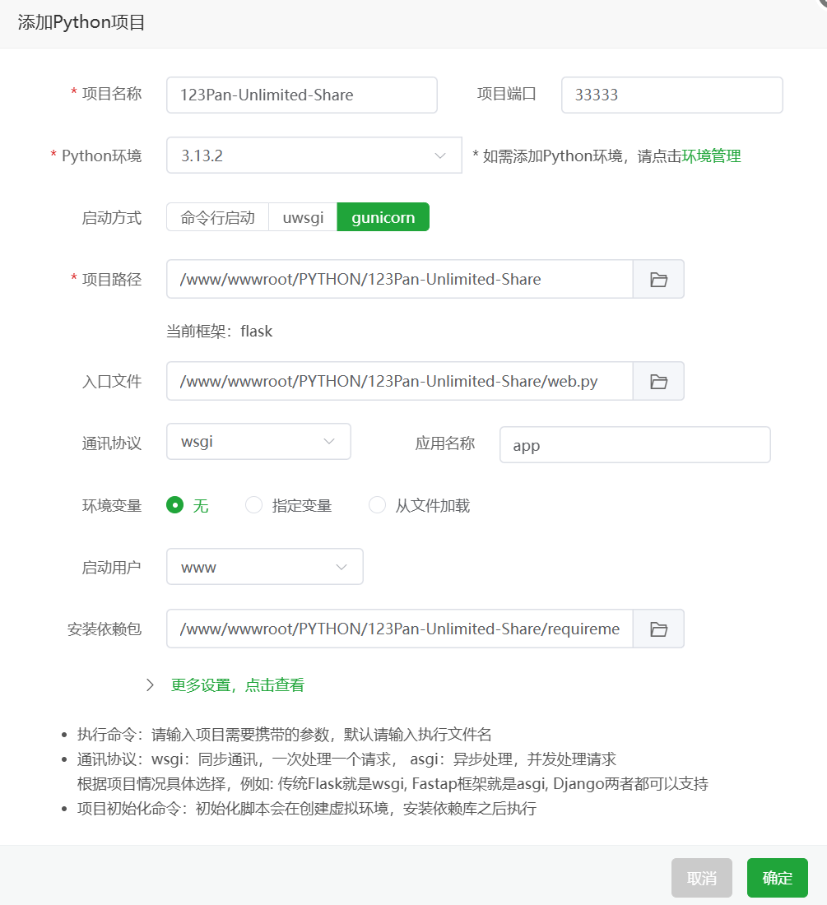
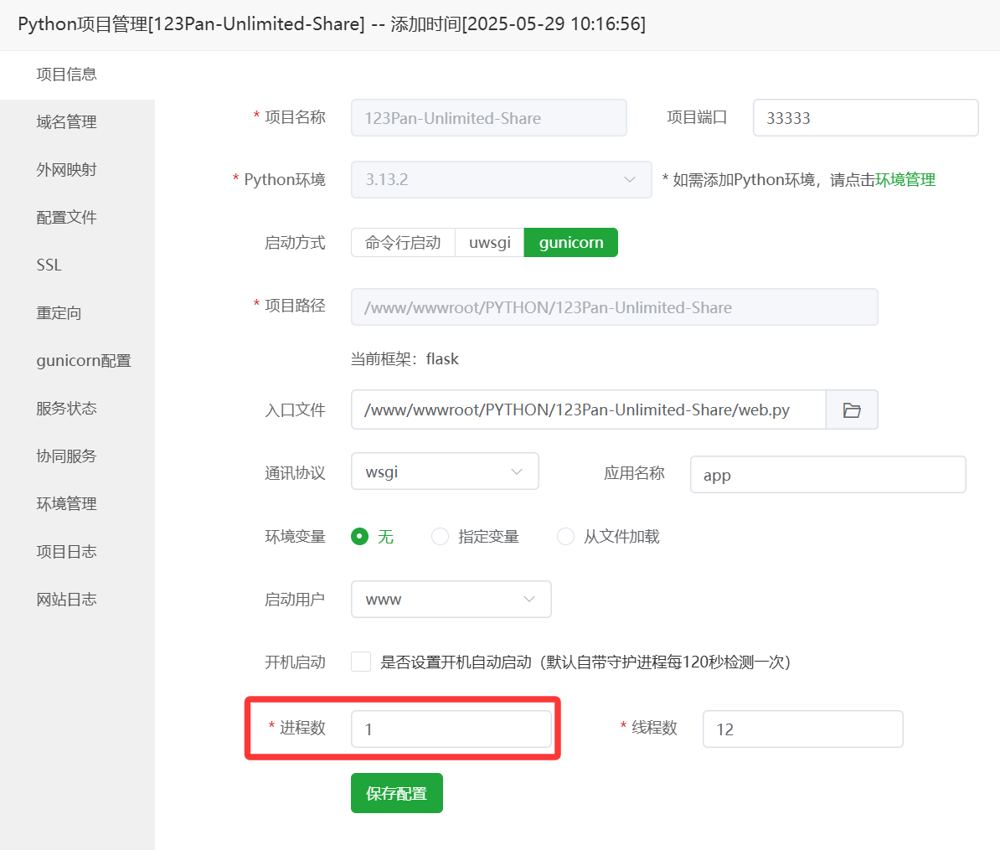

# [123云盘](https://www.123pan.com) 无限制分享工具（服务器 `gunicorn` 部署教程）

## 目录

- [123云盘 无限制分享工具（服务器 `gunicorn` 部署教程）](#123云盘-无限制分享工具服务器-gunicorn-部署教程)
  - [目录](#目录)
  - [重要提示](#重要提示)
  - [使用宝塔面板部署（以9.6.0版本为例）](#使用宝塔面板部署以960版本为例)
    - [一、下载本项目的文件](#一下载本项目的文件)
    - [二、进入后台](#二进入后台)
    - [三、创建 `Python` 项目](#三创建-python-项目)
    - [四、进一步配置](#四进一步配置)
    - [五、配置域名、HTTPS、WAF等](#五配置域名httpswaf等)

## 重要提示

- 推荐在 `中国大陆` 地区的服务器上部署，避免因为境外 IP 导致登录风险提示

- 网页前端检测到用户为中国大陆 IP 时，不提供服务 

## 使用宝塔面板部署（以9.6.0版本为例）

### 一、下载本项目的文件

- 打包好的文件发布在 [GitHub Releases](https://github.com/realcwj/123Pan-Unlimited-Share/releases) 中

- 解压后，得到 `123Pan-Unlimited-Share` 文件夹，将该文件夹放在服务器中，例如：`/www/wwwroot/123Pan-Unlimited-Share`

- **重要：请务必参考文档 [123云盘无限制分享工具（配置参数）](./SETTINGS.md) 修改 `settings.yaml` 配置文件**

### 二、进入后台

- 进入：`网站` → `Python项目` → `添加Python项目`

### 三、创建 `Python` 项目

- 参数设置
  - 项目名称：`123Pan-Unlimited-Share`
  - Python环境：`Python3.12`
  - 启动方式：`gunicorn`
  - 项目端口：取决于你在 `settings.yaml` 里配置的端口
  - 项目路径：取决于本项目在服务器中的路径，例如 `/www/wwwroot/123Pan-Unlimited-Share`
  - 入口文件：选择 `/www/wwwroot/123Pan-Unlimited-Share/web.py`**（注意是 `web.py`，不是 `run.py`）**
  - 通讯协议：`wsgi`
  - 应用名称：`app`（此项不能改）
  - 环境变量：无
  - 启动用户：`www`
  - 安装依赖包：`/www/wwwroot/123Pan-Unlimited-Share/requirements.txt`
  - 项目初始化命令：不填

- 示例

  

- 随后，点击确定，等待项目部署完成

### 四、进一步配置

- `123Pan-Unlimited-Share` 项目创建完成后，点击末尾的 `设置` 按钮

- 如下图所示，**请务必确保 `进程数` 为 `1`**，`线程数` 可根据服务器配置自由设定 

  

- 随后，点击确定，项目配置完成

### 五、配置域名、HTTPS、WAF等

- ⚠️ 重要, 请务必配置! 但此处不再介绍