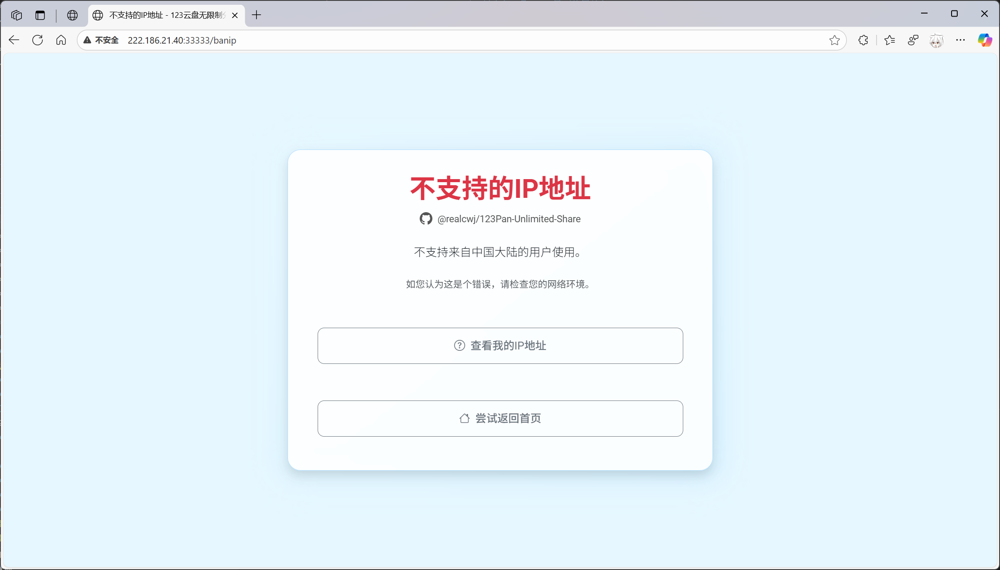
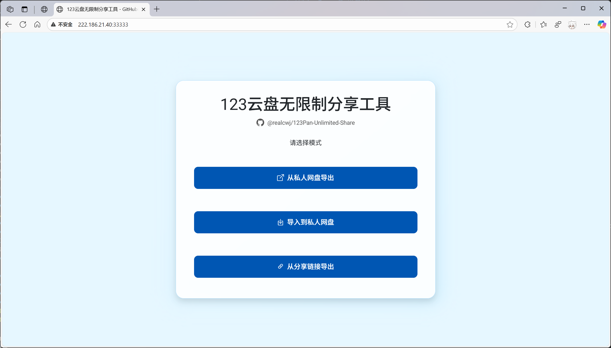
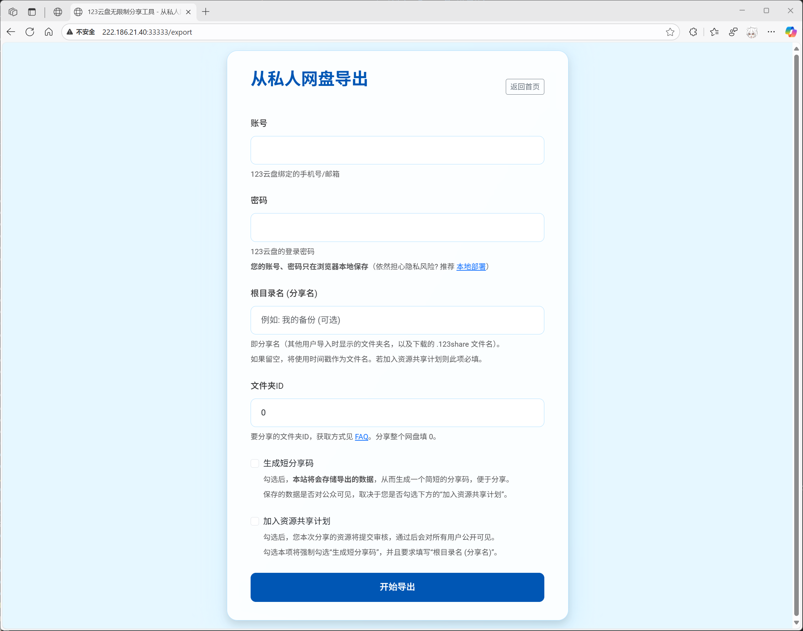
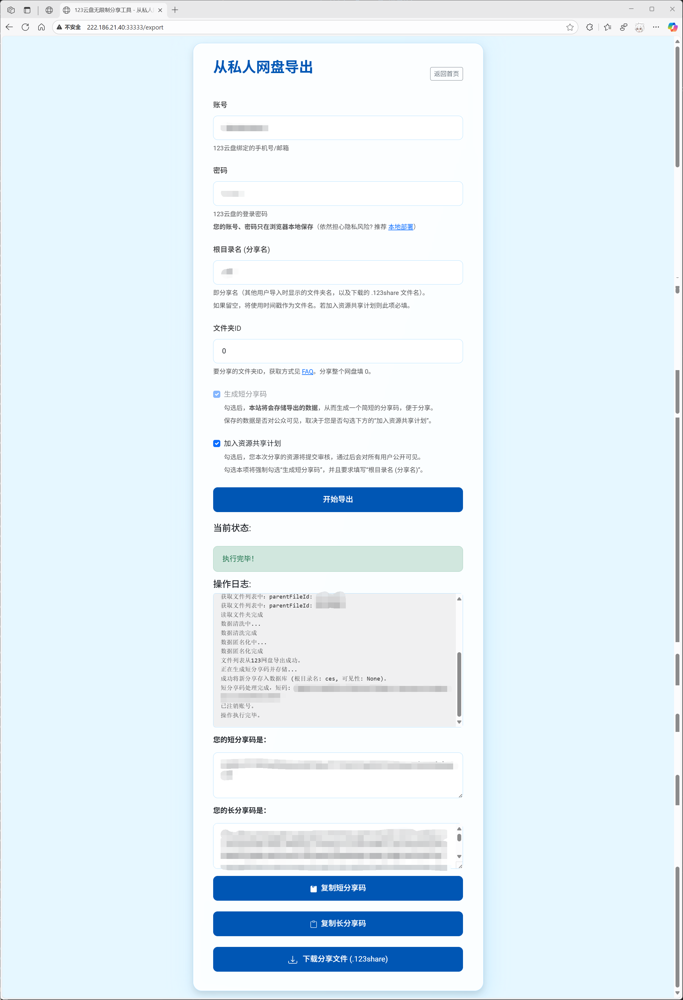
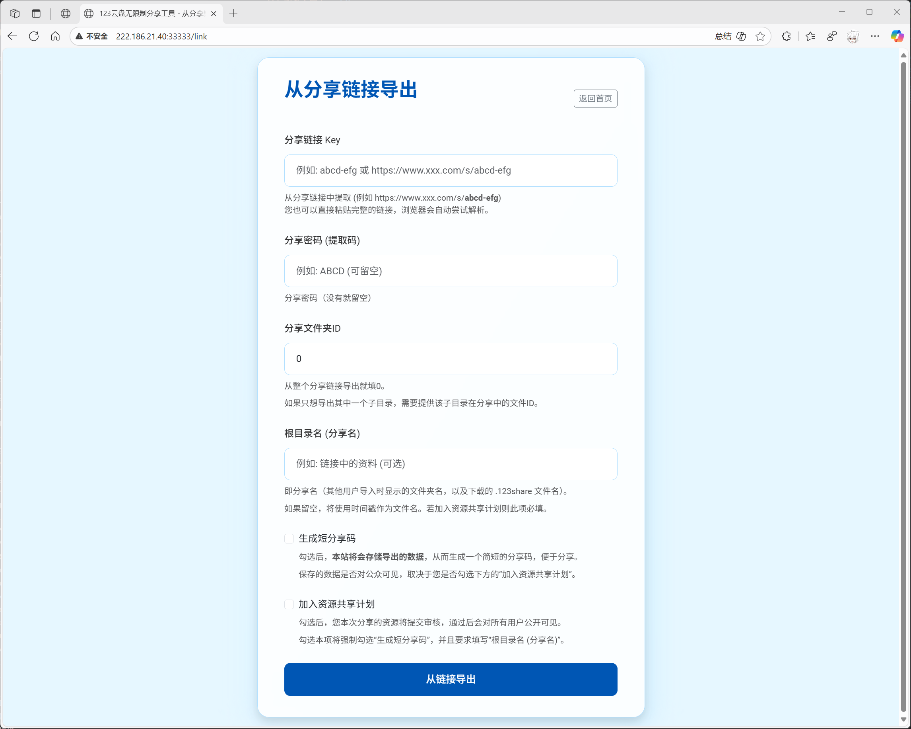
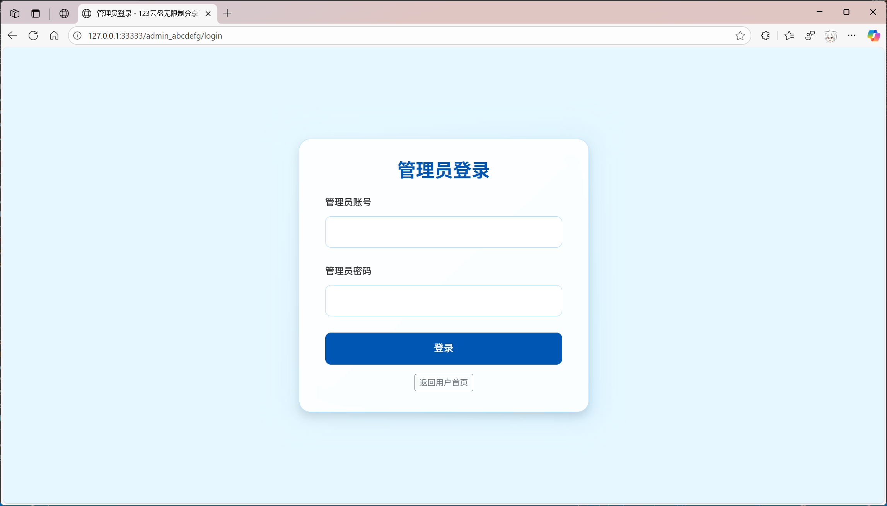
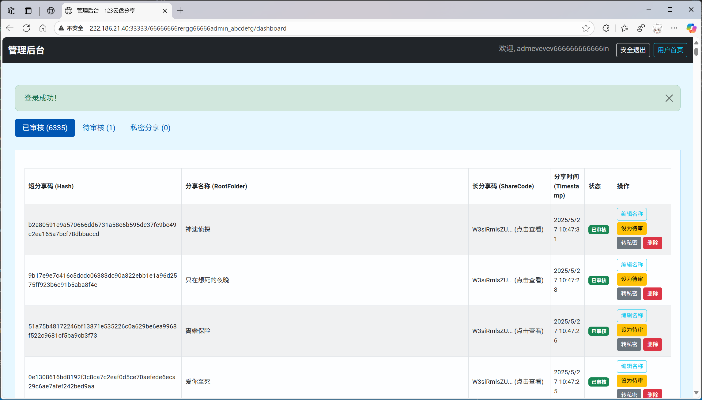

# [123云盘](https://www.123pan.com) 无限制分享工具（Web界面使用教程）

## 目录

- [123云盘 无限制分享工具（Web界面使用教程）](#123云盘-无限制分享工具web界面使用教程)
  - [目录](#目录)
  - [连接网络、下载安装浏览器](#连接网络下载安装浏览器)
  - [重要提示](#重要提示)
  - [打开网页](#打开网页)
    - [访问链接](#访问链接)
    - [界面截图](#界面截图)
  - [`从私人网盘导出` 功能](#从私人网盘导出-功能)
    - [`从私人网盘导出` 界面截图](#从私人网盘导出-界面截图)
    - [参数介绍](#参数介绍)
    - [运行结果截图](#运行结果截图)
    - [运行结果参数介绍](#运行结果参数介绍)
  - [`导入到私人网盘` 功能](#导入到私人网盘-功能)
    - [`导入到私人网盘` 界面截图](#导入到私人网盘-界面截图)
    - [参数介绍](#参数介绍-1)
    - [导入方式](#导入方式)
      - [从公共资源库导入](#从公共资源库导入)
      - [从短分享码导入](#从短分享码导入)
      - [从长分享码导入](#从长分享码导入)
  - [`从分享链接导出` 功能](#从分享链接导出-功能)
    - [`从分享链接导出` 界面截图](#从分享链接导出-界面截图)
    - [参数介绍](#参数介绍-2)
  - [后台管理页面](#后台管理页面)


## 连接网络、下载安装浏览器

- 基础问题，不解释。

## 重要提示

- 网页前端检测到用户为中国大陆 IP 时，**不提供服务**，将会跳转到拒绝页面，此举是为了规避潜在的风险。

  

## 打开网页

### 访问链接

- 如果您是自己本地部署，访问链接请见控制台窗口，例如：

    ```shell
    (py312) d:\123Pan-Unlimited-Share>python web.py
    * Serving Flask app 'web'
    * Debug mode: off
    WARNING: This is a development server. Do not use it in a production deployment. Use a production WSGI server instead.
    * Running on all addresses (0.0.0.0)
    * Running on http://127.0.0.1:33333        <<< 访问连接在这里（本机）
    * Running on http://198.18.0.1:33333       <<< 访问连接在这里（局域网）
    Press CTRL+C to quit
    ```

- 也可以使用本人部署的网页（服务器很渣，建议自己部署使用）：[>>> 点击这里进入 <<<](http://222.186.21.40:33333/)。

- 您也可以使用他人部署的网站，请见：（没有🥺）

### 界面截图

- 主界面如下

    

## `从私人网盘导出` 功能

### `从私人网盘导出` 界面截图

- 界面如下

    

### 参数介绍

- ⚠️**特别说明**：网站使用 Cookies 在浏览器**本地存储**你的用户名密码，以此实现每次刷新页面时自动填入账号密码的功能，**网站不会记录你的账号密码数据**。此外，请不要在公共电脑上使用。

- **账号**：填写你123云盘的手机号/邮箱。

- **密码**：填写你123云盘的密码。

- **根目录名 (分享名)**：例如：`ABC`，后续下载的文件将会以 `ABC.123share` 命名，别人导入时，会以 `ABC` 作为导入的根目录文件名）。

- **文件夹ID**：填写你要分享的文件夹的ID，获取方式请参考：[>>> FAQ <<<](https://github.com/realcwj/123Pan-Unlimited-Share#faq)。

- **生成短分享码**：勾选后，本站将会存储导出的数据，从而生成一个简短的分享码，便于分享。保存的数据是否对公众可见，取决于您是否勾选下方的“加入资源共享计划”。

- **加入资源共享计划**：勾选后，您本次分享的资源将提交审核，通过后会对所有用户公开可见。勾选本项将强制勾选“生成短分享码”，并且要求填写“根目录名 (分享名)”。

### 运行结果截图

- **⚠️请耐心等待程序运行，运行速度取决于分享的文件总数。**

- 界面如下

    

### 运行结果参数介绍

- **操作日志**：这里会实时显示当前导出进度。

- **短分享码**：短分享码，用于分享给他人。**仅限在本站内使用**

- **长分享码**：长分享码，用于分享给他人。**不同站点都可通用**

## `导入到私人网盘` 功能

### `导入到私人网盘` 界面截图

- 界面如下

  

### 参数介绍

- ⚠️**特别说明**：网站使用 Cookies 在浏览器**本地存储**你的用户名密码，以此实现每次刷新页面时自动填入账号密码的功能，**网站不会记录你的账号密码数据**。此外，请不要在公共电脑上使用。

- **账号**：填写你123云盘的手机号/邮箱。

- **密码**：填写你123云盘的密码。

### 导入方式

#### 从公共资源库导入

- 关于公共资源库的介绍，请参考：[123云盘无限制分享工具（公共资源库介绍文档）](./PUBLIC_SHARE.md)

#### 从短分享码导入

- 您可以使用他人分享给你的短分享码，导入到您的私人网盘。

- **短分享码**：他人分享给你的短分享码。

#### 从长分享码导入

- 您可以使用他人分享给你的长分享码，导入到您的私人网盘。

- **选择.123share 文件（可选）**：选择你要导入的 `*.123share` 文件。注意：文件名中的 `*` 部分会作为导入的根目录文件名。

    选择文件后，将自动填入下方的 `长分享码` 和 `根目录名`，您也可以不选择文件，手动填入下方的信息。

- **长分享码**：他人分享给你的长分享码，也就是 `*.123share` 文件中的内容。

- **根目录名**：例如：`ABC`，后续导入的文件将会以 `ABC` 作为导入的根目录文件名）。

## `从分享链接导出` 功能

### `从分享链接导出` 界面截图

- 界面如下

  

### 参数介绍

- **分享链接 Key**：例如，分享链接：`https://www.xxx.com/s/abcd-efg`，此处填写末尾的 `abcd-efg` 部分。

    **您也可以粘贴完整链接，例如：`https://www.xxx.com/s/abcd-efg`，浏览器会自动尝试解析。**

- **分享密码 (提取码)**：填写分享密码，例如，`ABCD`，如果没有密码就不填

- **分享文件夹ID**：保持默认 `0` 即可，代表导出整个分享链接。

- **根目录名 (分享名)**：例如：`ABC`，后续下载的文件将会以 `ABC.123share` 命名，别人导入时，会以 `ABC` 作为导入的根目录文件名）。

- **生成短分享码**：勾选后，本站将会存储导出的数据，从而生成一个简短的分享码，便于分享。保存的数据是否对公众可见，取决于您是否勾选下方的“加入资源共享计划”。

- **加入资源共享计划**：勾选后，您本次分享的资源将提交审核，通过后会对所有用户公开可见。勾选本项将强制勾选“生成短分享码”，并且要求填写“根目录名 (分享名)”。

## 后台管理页面

- 后台页面地址因人而异，参考文档：[123云盘无限制分享工具（配置参数介绍文档）](./SETTINGS.md)

  

- 后台控制台页面包括 `更新数据库` 按钮, 点击后将会从本 GitHub 项目中下载最新的数据库, 合并到本地数据库中。

  